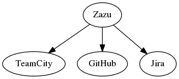
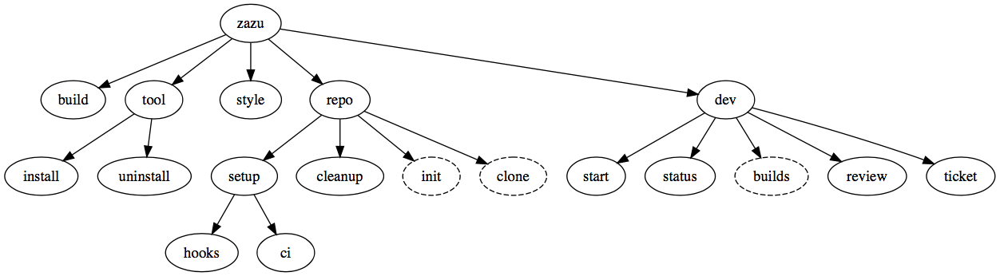

#Zazu (at your service) 

Zazu is a CLI development workflow management tool that combines elements of git flow with CI and issue tracking.

<!---
digraph G {
  "Zazu" -> "TeamCity"
  "Zazu" -> "GitHub"
  "Zazu" -> "Jira"
}
-->

Zazu is implemented in Python and is a [Click](http://click.pocoo.org/5/) based CLI. If you're wondering why Click, this is a well [answered](http://click.pocoo.org/5/why/) question.

##Install
`pip install --upgrade --trusted-host pypi.lily.technology --index-url http://pypi.lily.technology:8080/simple zazu`

If you get an error that "trusted-host" is not a recognized argument you may need to upgrade pip itself: `pip install --upgrade pip`

##Command overview
The following diagram shows the available subcommands of zazu.

<!---
digraph G {
  "zazu" -> "build"
  "zazu" -> "tool"
  "tool" -> "install"
  "tool" -> "uninstall"
  "zazu" -> "style"
  "zazu" -> "repo"
  "repo" -> "setup"
  "setup" -> "hooks"  
  "setup" -> "ci"
  "repo" -> "cleanup"
  "repo" -> "repo_init"
  repo_init [label=init, style=dashed]
  "repo" -> "repo_clone"
  repo_clone [label=clone, style=dashed]
  "zazu" -> "dev"
  "dev" -> "start"
  "dev" -> "status"
  dev_builds [label=builds, style=dashed]
  "dev" -> "dev_builds"
  "dev" -> "review"
  "dev" -> "ticket"
}
-->

Note: dashed lines are not yet implemented

##Repo management 
- `zazu repo clone <name>` clones repo from github and installs GIT hooks (Unimplemented)
- `zazu repo init <name>` initializes repo to default project structure (Unimplemented)
- `zazu repo setup hooks` installs default GIT hooks to the repo
- `zazu repo setup ci` sets up CI builds based on the zazu.yaml file in the repo

###CI build configuration management
Zazu can setup CI server builds (currently only TeamCity is supported) to build targets specified by a recipe file (the zazu.yaml file in the root of a repo).

- `zazu repo setup ci`

##Development workflow management
- `zazu dev start` interactivly creates new JIRA ticket
- `zazu dev start <name>` e.g. `zazu dev start LC-440_a_cool_feature`
- `zazu dev status` displays ticket and pull request status
- `zazu dev ticket` launches web browser to the ticket page
- `zazu dev builds` launches web browser to the CI project page
- `zazu dev review` launches web browser to create/view a pull request

##Code Style Enforcement
- `zazu style` fixes code style using astyle and autopep8

##Building
Zazu uses the zazu.yaml file to build goals defined there

- `zazu build <goal>`
- The target architecture is assumed to be 'local' but may be overridden using the --arch flag. e.g `zazu build --arch=arm32-linux-gnueabihf package` would build targeting 32 bit arm linux.

##Build tool instalation
Zazu will automatically try to obtain required build tools needed for each target as specified in the zazu.yaml file. These may be installed/uninstalled manually as well:

- `zazu tool install <tool==version>`
- `zazu tool uninstall <tool==version>`

These tools will be installed to the `~/.zazu/tools/` folder.

##zazu.yaml file
The zazu.yaml file lives at the base of the repo and describes the CI goals and architectures to be run. In addition it describes the requirements for each goal.
	

	components:
	  - name: networkInterface
	    goals:
	      - name: coverage
	        description: "Runs the \"check\" target and reports coverage via gcovr"
	        buildType: coverage
	        buildVars:
	              LOCAL_SERVER: ON
	        builds:
	          - arch: x86_64-linux-gcc
	      - name: package
	        buildType: minSizeRel          
	        builds:
	          - arch: arm32-linux-gnueabihf
	            requires:
	              zazu:
	                - gcc-linaro-arm-linux-gnueabihf==4.9
	          - arch: x86_64-linux-gcc

	style:
	  exclude:
	    - dependencies/ #list path prefixes here to exclude from style
	    - build/
	  astyle:
	    options:
	      - "--options=astyle.conf" # options passed to astyle
	    include:
	      - src/*.cpp # list of globs of files to style
	      - include/*.h
	      - test/*.cpp
	  autopep8:
	    options:
	      - "--max-line-length=150" # options passed to autopep8

###Compiler tuples
Architectures are defined as tupple in the folowing form:
`<ISA>-<OS>-<ABI>`
####Examples
- x86\_64-linux-gcc
- x86\_32-linux-gcc
- x86\_64-win-msvc_2013
- x86\_64-win-msvc_2015
- x86\_32-win-msvc_2013
- x86\_32-win-msvc_2015
- arm32-linux-gnueabihf
- arm32-none-eabi

##Command autocompletion
Note that autocompletion currently only works for commands and subcommands (not arguments)
###BASH users
Add the following to your `~/.bashrc` file:

	_zazu_completion() {
	    COMPREPLY=( $( env COMP_WORDS="${COMP_WORDS[*]}" \
	                   COMP_CWORD=$COMP_CWORD \
	                   _ZAZU_COMPLETE=complete $1 ) )
	    return 0
	}
	
	complete -F _zazu_completion -o default zazu;
	
###ZSH users
Add the following to your `~/.zshrc` file
	
	autoload bashcompinit
	bashcompinit	
	_zazu_completion() {
	    COMPREPLY=( $( env COMP_WORDS="${COMP_WORDS[*]}" \
	                   COMP_CWORD=$COMP_CWORD \
	                   _ZAZU_COMPLETE=complete $1 ) )
	    return 0
	}
	
	complete -F _zazu_completion -o default zazu;